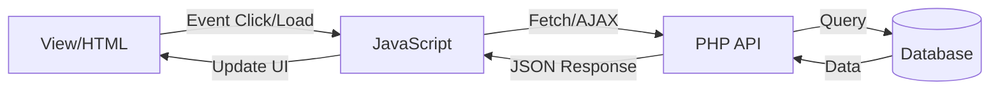

# Panduan Alur Pengembangan & Hubungan File

Dokumen ini menjelaskan bagaimana file-file dalam project **CrypMerce** saling berhubungan. Gunakan panduan ini untuk menelusuri fitur atau debugging.

## 🔄 Pola Umum (The General Flow)

Aplikasi ini menggunakan pola **Separated Frontend & Backend** (meskipun dalam satu repo).
Alurnya selalu bergerak dari:
**Frontend (Tampilan)** ➡️ **JavaScript (Logika)** ➡️ **API (PHP Backend)** ➡️ **Database**



---

## 🗺️ Peta Hubungan File

### 1. View Layer (Apa yang user lihat)

- **Lokasi**: `web/user/*.html` atau `web/seller/views/*.php`
- **Fungsi**: Menampilkan struktur halaman.
- **Ciri-ciri**:
  - Memiliki ID unik pada elemen (contoh: `<button id="btn-login">`)
  - Memanggil file CSS dan JS di bagian `<head>` atau bawah `<body>`.

### 2. Interaction Layer (Penghubung)

- **Lokasi**: `web/assets/js/`
- **Fungsi**: Menangani klik, validasi, dan memanggil API.
- **Cara Mencari**:
  - Cari ID elemen dari HTML di folder ini (contoh: `document.getElementById('btn-login')`).
  - Lihat fungsi `fetch()` untuk mengetahui ke API mana data dikirim.

### 3. Logic/Data Layer (Pemroses)

- **Lokasi**: `web/api/`
- **Fungsi**: Menerima data, bicara ke database, mengembalikan JSON.
- **Cara Mencari**:
  - Nama file biasanya mirip dengan fungsinya (contoh: `login.php`).
  - Menerima input via `$_POST` atau `php://input`.

---

## 🕵️‍♂️ Contoh Kasus: "Saya ingin menelusuri fitur Login"

Ikuti langkah 1-2-3 ini:

### Langkah 1: Mulai dari Tampilan (Frontend)

Buka file `web/user/login.html` (atau sejenisnya).
Cari tombol yang diklik user.

```html
<!-- Contoh di HTML -->
<button id="loginSubmit">Masuk</button>
```

👉 **Kata Kunci**: `loginSubmit`

### Langkah 2: Cari Logic-nya (JavaScript)

Buka folder `web/assets/js/` dan cari teks `loginSubmit`.
Anda akan menemukan `web/assets/js/auth/login.js`.

```javascript
// Contoh di JavaScript
document.getElementById('loginSubmit').addEventListener('click', function() {
    // ...
    fetch('../../api/auth/login.php', { ... }) // <--- INI KUNCINYA
});
```

👉 **Kata Kunci**: `api/auth/login.php`

### Langkah 3: Cari Backend-nya (PHP)

Buka file yang ditemukan tadi: `web/api/auth/login.php`.
Di sini Anda akan melihat query database.

```php
// Contoh di PHP
$query = "SELECT * FROM users WHERE email = ?";
```

---

## 💡 Tips Cepat Mencari File

| Jika Anda mencari...                       | Cek folder ini...             |
| :----------------------------------------- | :---------------------------- |
| **Tampilan berantakan / Ganti warna**      | `web/assets/css/`             |
| **Tombol tidak bisa diklik**               | `web/assets/js/`              |
| **Data tidak muncul / Error gagal simpan** | `web/api/`                    |
| **Setting Database / API Key**             | `web/api/config/` atau `.env` |

## 🛠️ Debugging Flow

Jika fitur tidak jalan, cek secara berurutan:

1.  **Cek Console Browser (F12)**: Apakah ada error merah? (Biasanya error JS).
2.  **Cek Network Tab (F12)**: Lihat request ke API.
    - Merah (404/500)? Masalah di **PHP API**.
    - Response data salah? Masalah di **PHP API**.
    - Tidak ada request? Masalah di **JavaScript**.
3.  **Cek PHP Error Log**: Masalah syntax atau database di backend.
